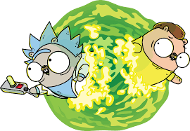

## Course Learn Go Lang

## Class   

* ### Playground
  - [Class 1](Playground/01-aula.go)
  - [Class 2](Playground/02-aula.go)
  - [Class 3](Playground/03-aula.go)
  - [Class 4](Playground/04-aula.go)
  - [Class 5](Playground/05-aula.go)
  - [Class 7](Playground/07-aula.go)
  - [Class 8](Playground/08-aula.go)

## Exercises
* ### Nivel 1
  - [Ninja 1](Exercícios/01-Nivel/01-exercicio.go) 
  - [Ninja 1](Exercícios/0-Nivel/02-exercicio.go) 

## Credits
[Link do repositório](https://github.com/ellenkorbes/aprendago)

[Link do curso no youtube](https://www.youtube.com/playlist?list=PLCKpcjBB_VlBsxJ9IseNxFllf-UFEXOdg) 
