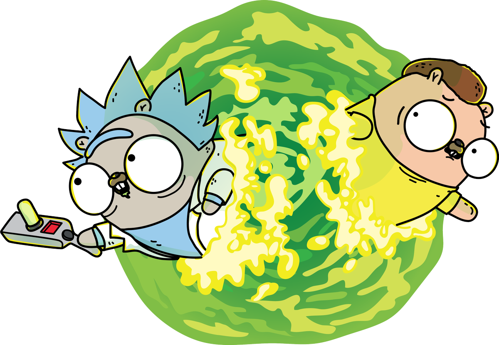

## Course Learn Go Lang




```go
package main

import "fmt"

func main() {
	fmt.Println("Hello World !")
}
```
## Class   

[Summary](summary.md)

<!-- ## Exercises: Level #1   
- [X] Exercises 1
- [X] Exercises 2
- [X] Exercises 3
- [X] Exercises 4
- [X] Exercises 5
- [ ] Exercises 6

##  Exercises: Level #2   
- [X] Exercises 1
- [ ] Exercises 2
- [ ] Exercises 3
- [ ] Exercises 4
- [ ] Exercises 5
- [ ] Exercises 6
- [ ] Exercises 7
## Exercícios: Nível #3   
- [ ] Exercises 1   
- [ ] Exercises 2   
- [ ] Exercises 3   
- [ ] Exercises 4   
- [ ] Exercises 5   
- [ ] Exercises 6   
- [ ] Exercises 7   
- [ ] Exercises 8   
- [ ] Exercises 9   
- [ ] Exercises 10  

## Exercises: Nível #4   
- [X] Exercises 1   
- [X] Exercises 2   
- [X] Exercises 3   
- [ ] Exercises 4   
- [ ] Exercises 5   
- [ ] Exercises 6   
- [ ] Exercises 7   
- [ ] Exercises 8   
- [ ] Exercises 9   
- [ ] Exercises 10 

## Exercícios: Nível #5   
- [X] Exercícios 1   
- [X] Exercícios 2   
- [X] Exercícios 3   
- [X] Exercícios 4   

##  Exercícios: Nível #6   
- [ ] Exercícios 1   
- [ ] Exercícios 2   
- [ ] Exercícios 3   
- [ ] Exercícios 4   
- [ ] Exercícios 5   
- [ ] Exercícios 6   
- [ ] Exercícios 7   
- [ ] Exercícios 8   
- [ ] Exercícios 9   
- [ ] Exercícios 10   
- [ ] Exercícios 11   

##  Exercícios: Nível #7   
- [X] Exercícios 1   
- [X] Exercícios 2    -->
## Credits
[Link do repositório](https://github.com/ellenkorbes/aprendago)

[Link do curso no youtube](https://www.youtube.com/playlist?list=PLCKpcjBB_VlBsxJ9IseNxFllf-UFEXOdg) 
